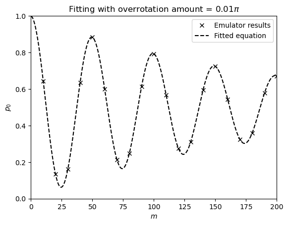

# Amount of over- or under-rotation

In this directory we have the code for benchmarking the amount of over- or under-rotation of a single-qubit gate.

### Parameters

To run the benchmark, you will need to run the `over_under_rotation_demo.ipynb` notebook.

There are parameters that can be adjusted, such as:

- `delta_m` - spacing number of repetitions of pseudoidentity formed by repeating the gate

- `m_max` - maximum number of repetitions

- `num_shots` - the number of measurement shots

- `device_name` - the name of the (AWS) device to use. Default to "noisy_sim" for noisy simulations

### Usage

As the notebook is set up now, if the required dependencies are installed, you may run the notebook with jupyter notebook by clicking on 'Run All'.

This will run the estimation of the amount of over- or under-rotation of an SX gate using a noisy simulator.

In the end of the notebook the survival probability against the number of pseudoidentities is plotted, as well as the fit for the amount of over- or under-rotation.

