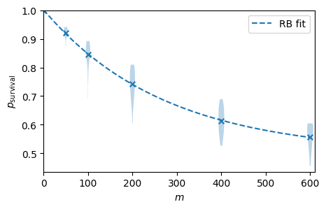

# Clifford Randomized Benchmarking

This directory contains the code for Clifford randomized benchmarking (RB) average gate error metric. This metric provides an estimate of the average gate error of a set of single- or multi-qubit Clifford gates in a quantum computer. To run this metric, please use the `clifford_rb.ipynb` file.

### Parameters

To run the RB protocol, you will need to run the `clifford_rb.ipynb` file.

There are parameters that can be adjusted, such as:

- `n_qubits` - the number of qubits to run RB on. Choose from 1 or 2

- `n_cliffords` - the list of the number of Clifford gates, i.e., a list of circuit depths

- `samples_per_depth` - the number of randomised circuits for each number of Clifford gates

- `shots` - the number of shots

- `device_name` - the name of the (AWS) device to use. Default to "noisy_sim" for noisy simulations

- `noise_model` - an optional `qiskit_aer.noise.NoiseModel` to use for noisy simulations

### Usage

The python notebook uses the `rb.py` module in the base directory `randomized_benchmarking`. To run Clifford randomized benchmarking, you may use the `clifford_rb.ipynb` notebook.

This will run the RB protocol simulations for the set parameters, the circuit data is output in the hardware_runs directory, and then the results are presented in the python notebook. 

The output will look similar to the following plot.

  

Additionally, the note book will print out the Clifford randomized benchmarking average gate error.
