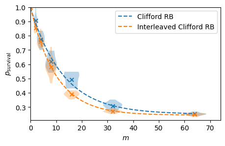

# Interleaved Clifford Randomized Benchmarking

This directory contains the code for interleaved randomized benchmarking (IRB). The interleaved Clifford randomized benchmarking (RB) gate error provides an estimate for the average error of a target Clifford gate in a gate set

### Parameters

To run the IRB protocol, you will need to run the `interleaved_rb.ipynb` python notebook.

There are parameters that can be adjusted, such as:

There are parameters that can be adjusted, such as:

- `n_qubits` - the number of qubits to run RB on. Choose from 1 or 2

- `n_cliffords` - the list of the number of Clifford gates, i.e., a list of circuit depths

- `samples_per_depth` - the number of randomised circuits for each number of Clifford gates

- `interleaved_circuit` - here the user specifies the target Clifford gate to be interleaved as a `qiskit.circuit.quantumcircuit.QuantumCircuit` object.

- `shots` - the number of shots

- `device_name` - the name of the (AWS) device to use. Default to "noisy_sim" for noisy simulations

- `noise_model` - an optional `qiskit_aer.noise.NoiseModel` to use for noisy simulations

### Usage

The output for running interleaved Clifford randomized benchmarking will look like the following:

It plots the success probability vs depth (number of Clifford gates) for both the RB and IRB circuits in order to find the gate specific error. The fit and gate errors will be provided inside the python notebook.  
