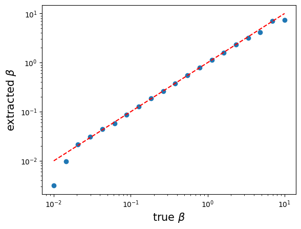
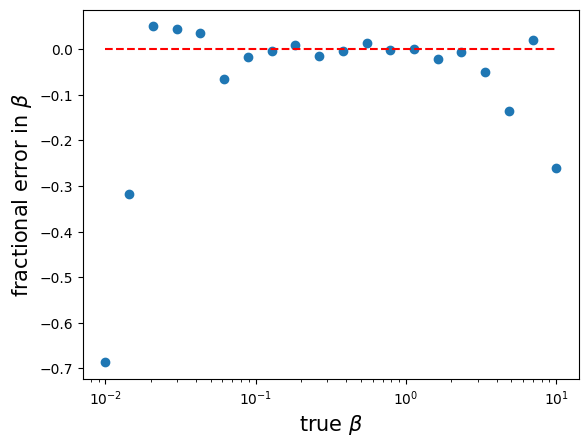

# Single qubit control errors for quantum annealers

In this directory we have the example code for calculating the single qubit control errors for quantum annealers, also referred to as bias strength, via the domain wall method.

### Core dependencies

 - `matplotlib` - for plotting results

 - `numpy` - for numerical calculations

 - `scipy` - for fitting

### Parameters

To calculate the metric, you will need to run the `domain_wall_noise_test.ipynb` notebook.

There are parameters that can be adjusted, such as:

- `n_site` - the number of terminal sites.

- `n_sample` - the number of samples to be taken.

- `n_betas` - the number of inverse temperatures to test for.

### Usage

As the notebook is set up now, if the required dependencies are installed, you may run the notebook with jupyter notebook by clicking on 'Run All'.

This will run the single qubit control errors benchmark, where as an example, all data are randomly generated, but one can also run the calculations on real data gathered from a quantum annealer to extract the errors. A number of inverse tempeartures ($\beta$s) according to the specified `n_betas` will be tested, and two plots will be generated, one for the extracted $\beta$ against true $\beta$, and the other for the fractional error in $\beta$ against true $\beta$.

