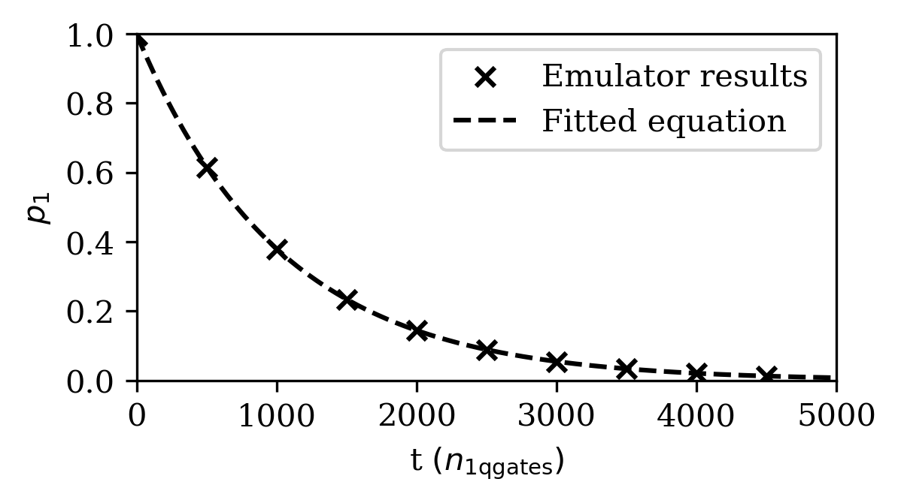

# T1 time

In this directory we have the code for the T1 time experiment.

### Parameters

To run the T1 time protocol on a simulator, you will need to run the `t1.ipynb` file. 

There are parameters that can be adjusted, such as:

- `max_num_identities` - this specifies the max number of idle gates to wait before measuring the qubit state . Increasing this will increase the runtime of the algorithm.

- `shots` - the number of measurement shots

This file uses the circuit submitter interface which will only calculate the T1 time in terms of number of 1 qubit gates. As a result, if you would like to calculate the T1 in terms of seconds, you should use pulse level access. 

### Usage

As the script is set up now, if the required dependencies are installed, you may run the script simply by running

`t1.ipynb`

##### For running on a simulator: 

This will run the T1 experiment on the Braket simulator for varying amplitude damping. The script will run the experiment up to the `max_num_identities`.

Then the data is output in the data subdirectory. Each run is in its own unique folder which is created depending on the time it was created.

In the subdirectory, there will be a plot output for the experiemnt.

### Example T1 time measurement on Braket with pulse level access

The T1 time is different to many other metrics since in order to run the metric in delay times in units of time, then pulse level access is required. 

Therefore, in this folder, we also include an example of software that was used to run the T1 time metric on AWS Braket quantum hardware with pulse level access in the  `braket_device_t1.py` file. This file is for use as an example of how one may run using pulse level access, as the devices that this file was run on have now been decomissioned. As a result the software will not be functional.

The parameters are:

- `device_choice` - the choice of which device you would like to benchmark on.

- `max_num_identities` - the max number of idle pulses.

- `shots` - the number of measurement shots.

- `wait_time_s` - the idle time for each idle pulse, in seconds.

