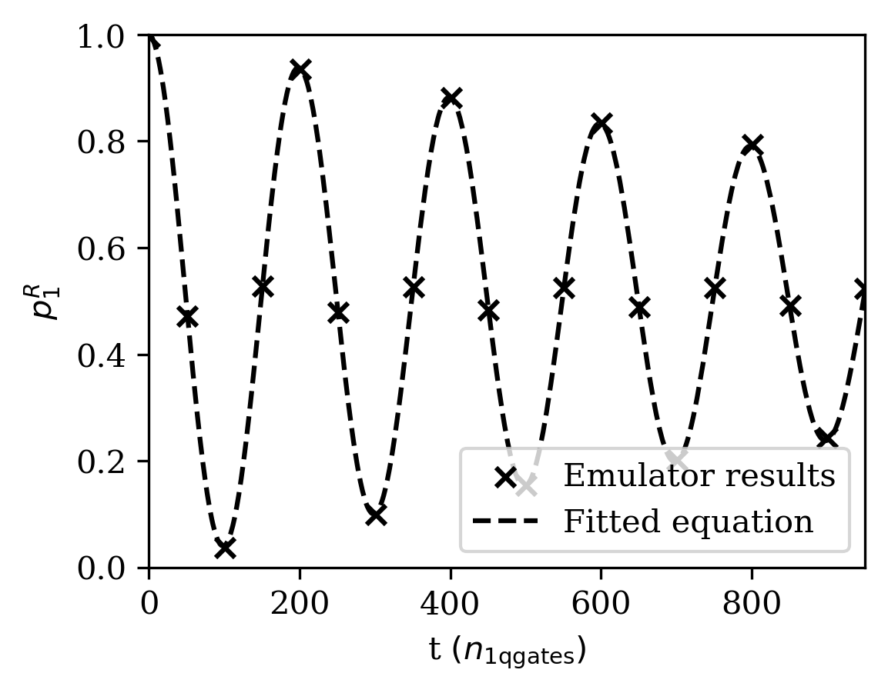
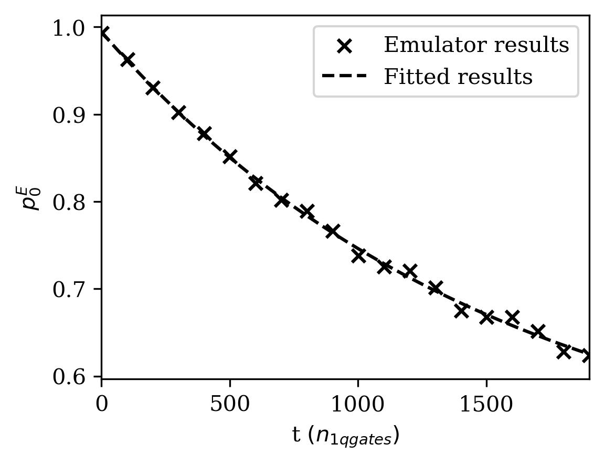

# T2 time

In this directory we have the code for the T2 time experiment.

### Parameters

To run the T2 time protocol, you will need to run the `t2.ipynb` notebook.

There are parameters that can be adjusted, such as:
- `max_num_identities` - the maximum number of qubit idle gates

- `shots` - the number of measurement shots

This uses the circuit submitter interface and calculates the T2* and T2 times in terms of the number of 1 qubit gates.

### Usage

As the script is set up now, if the required dependencies are installed, you may run the `t2.ipynb` notebook with jupyter notebook by clicking on 'Run All'.

This will run the T2 experiment using a noisy emulator with the custom noise model defined in the _helpers folder.

The results of the experiment including the value of T2* and T2 time will be printed in the notebook in terms of the number of 1 qubit gates. A plot for each the Ramsey and Hahn experiment will be output.

An example Ramsey T2* experiment plot is shown below:

An example Hahn echo T2 plot is shown below:

### Example T2 time measurement on Braket with pulse level access

The T2 time is different to many other metrics since in order to run the metric in delay times in units of time, then pulse level access is required. 

Therefore, in this folder, we also include an example of software that was used to run the T2 time metric on AWS Braket quantum hardware with pulse level access in the `t2_aws.ipynb` file. This file is for use as an example of how one may run using pulse level access, as the devices that this file was run on have now been decomissioned. As a result the software will not be functional.

In the `t2_aws.ipynb` notebook is code for running the T2* experiment on the AWS OQC Lucy device. Note that not all AWS devices have pulse level access. The parameters for `t2_aws.ipynb` include

- `frequency_shift` - the amount of frequency shift to detune the qubit frequency for

- `wait_time_s` - the wait time for one idle pulse

- `qubit` - the index of the qubit to benchmark

- `shots` - the number of measurement shots

- `max_steps` - the max number of idle pulses
