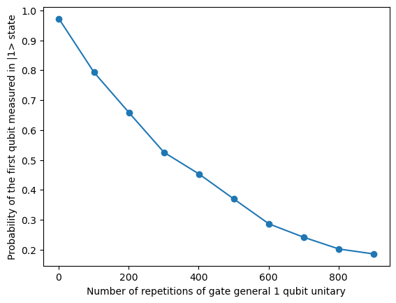

# Time taken to executa a general single- or multi-qubit gate

In this directory we have the code to estimate the single qubit physical gate time for a target gate, assuming the T1 time of the device is known.

### Parameters

To run the estimation of gate time, you will need to run the `time_taken_to_execute_a_general_single_or_multi_qubit_gate.ipynb` notebook. 

There are parameters that can be adjusted, such as:

- `total_repetitions` - the total number of repetitions of the target gate to be applied to the second qubit

- `shots` - the number of measurement shots

- `T1` - the known T1 time

- `device_name` - the name of the device to use. Default to "noisy_sim" for noisy simulations

- `noise_model` - an optional `qiskit_aer.noise.NoiseModel` to use for noisy simulations

### Usage

As the notebook is set up now, if the required dependencies are installed, you may run the notebook with jupyter notebook by clicking on 'Run All'.

This will run the estimation of single qubit physical gate time with qiskit using a noisy simulator that simulates the noise levels in the IBMQ Kolkata device, assuming the T1 time of the device is known.

A plot of the probabilities of the |1> state against the number of gates will be generated:

When the program finishes, the estimated gate time will be printed.
