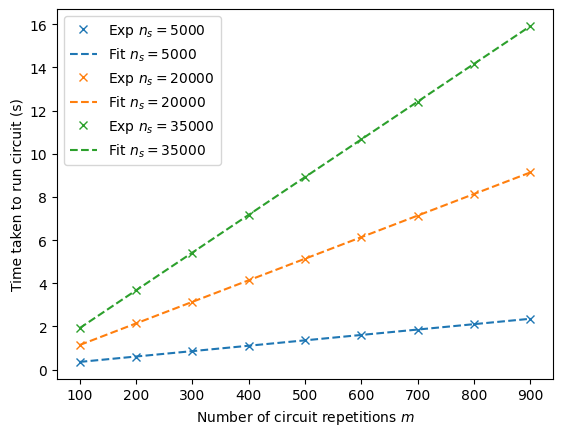

# Time to reset qubits

In this directory we have the code to estimate the time to reset qubits, assuming the maximum time to measure the qubits is known.

### Parameters

To run the estimation of measurement time, you will need to run the `time_to_reset_qubits.ipynb` notebook. 

There are parameters that can be adjusted, such as:

- `total_C_repetitions` - the total number of repetitions of the inner circuit

- `max_num_shots` - the maximum number of measurement shots

- `device_name` - the name of the (AWS) device to use. Default to using a model for the time to run circuits

- `max_measurement_time` - the known maximum time to measure the qubits

### Usage

As the notebook is set up now, if the required dependencies are installed, you may run the notebook with jupyter notebook by clicking on 'Run All'.

This will run the estimation of the time taken to reset qubits.

A plot of how the time taken to run circuits changes with different number of inner circuit repetitions and different number of shots will be generated:

When the program finishes, the estimated time taken to reset qubits will be printed.
