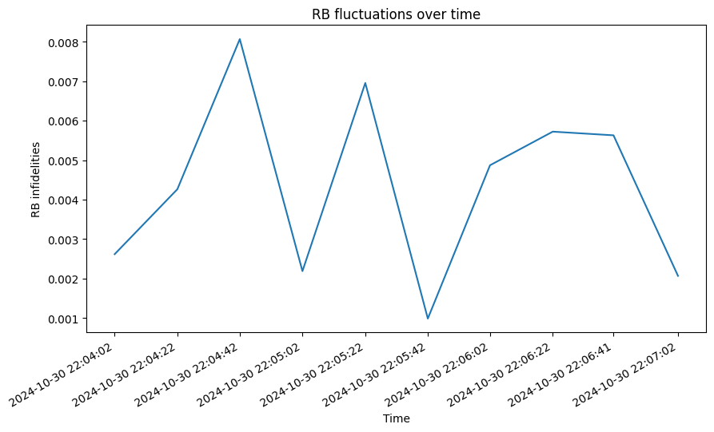

# Amount of fluctuations of metrics over time

This metric measures the fluctuation of a specific metric over a given time period. We use the Clifford randomized benchmarking average gate error as an example.

### Core dependencies

In order to run this code, you will require the following requirements file `pygsti_requirements.txt`. This is because we are measuring the Clifford randomized benchmarking average gate error over time, and the Clifford randomized benchmarking metric uses PyGSTi to generate the RB experiment.

### Parameters

To run the RB protocol, you will need to run the `rb_fluctuatios.ipynb` notebook. In order to emulate fluctuations of noise within a device, we generate a list of noise models that are called for each run of the RB protocol. A different noise model is used in each time step.

There are parameters that can be adjusted, such as:

- `n_qubits` - the number of qubits to run RB on. Choose from 1 or 2

- `n_cliffords` - the list of the number of Clifford gates, i.e., a list of circuit depths

- `samples_per_depth` - the number of randomised circuits for each number of Clifford gates

- `shots` - the number of shots

- `device_name` - the name of the (AWS) device to use. Default to "noisy_sim" for noisy simulations

- `benchmark_name` - the name of the folder to save each of the protocol runs

- `noise_model` - a `qiskit_aer.noise.NoiseModel`  used for noisy simulations

- `execution_number` - the number of times to repeat the RB experiment

- `wait_seconds` - the time interval in seconds between each RB experiment

### Usage

As the script is set up now, if the required dependencies are installed, you may run the notebook with jupyter notebook by clicking on 'Run All'.

This will create the RB experiment for 10 time steps, and then simulate experimental results, and run the RB algorithm to obtain the gate infidelities.

The script will output a plot like the following:

