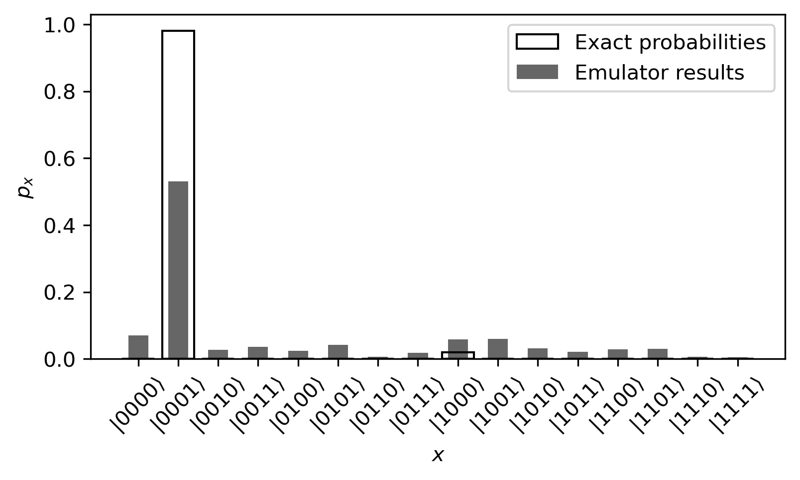

# Hubbard model simulation (HMS)

In this directory we have the code for Hubbard model simulation (HMS).

### Parameters

To run the Hubbard model simulation, you will need to run the `hubbard_model_simulation.ipynb` notebook. Details of the methdology is explained in the notebook as well as the metrics document.

There are parameters that can be adjusted, such as:

- `N` - the number of Fermionic sites.

- `t` - the hopping integral.

- `U` - the onsite energy.

- `dt` - time for each Totterisation step.

- `steps` - the number of Totterisation steps.

- `initial_state` - list of qubits to initialise into |1> instead of |0>.

- `device_name` - the name of the (AWS) device to use. Default to "noisy_sim" for noisy simulations.

- `noise_model` - an optional `qiskit_aer.noise.NoiseModel` to use for noisy simulations.

 The parameters are pre-set to `N`=4, `t`=2, `U`=2, `dt`=0.5, `steps`=10 and `initial_state`=[0] meaning the first qubit is initialised into |1> whereas all other qubits are initialised into |0>.

### Usage

As the notebook is set up now, if the required dependencies are installed, you may run the notebook with jupyter notebook by clicking on 'Run All'.

This will run the Hubbard model simulation with qiskit using both a noiseless state vector simulator and a noisy simulator that simulates the noise levels in the IBMQ Kolkata device.

A normalised fidelity between the two obtained probability distributions will be calculated. This together with the details of the simulations will be saved into the data subdirectory. Each run is in its own unique folder which is created depending on the time it was created.

In the subdirectory, there will be a plot output for the experiemnt.

